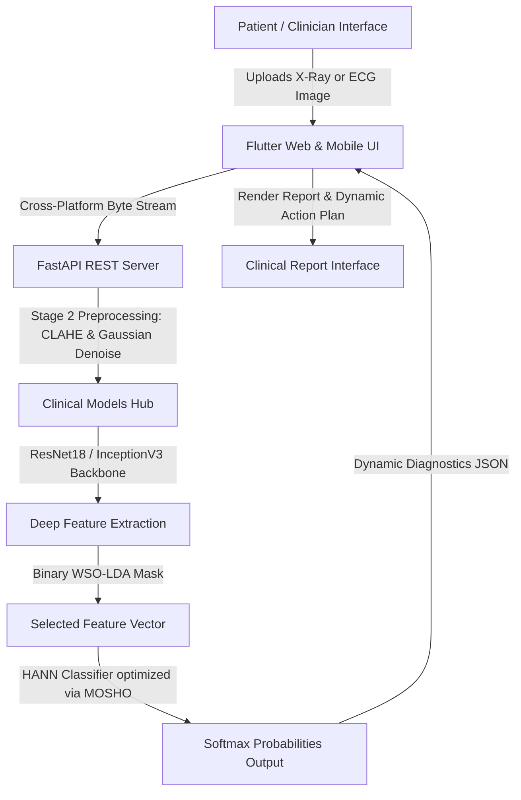

# 🩺 Clinical IoMT Multi-Diagnostic Platform: PneumoAI & CardioAI Hub

An advanced **Internet of Medical Things (IoMT) Healthcare Monitoring System** featuring real-time, high-fidelity clinical screening for **Lung Diseases (Pneumonia)** and **Heart Disease (Cardiac Arrhythmias & Myocardial Infarction)**. 

The platform integrates a high-performance **Flutter Web/Mobile Frontend** with a high-throughput **FastAPI Backend Server** powered by **ONNX Runtime** for standard edge-inference.

---

## 🚀 Unified Architectural Overview

The system is structured as an end-to-end medical decision support framework:



* **Frontend**: Crafted in cross-platform Flutter, optimizing memory leaks via **Uint8List byte arrays** to bypass Web sandboxing constraints and avoid filesystem exceptions on Chrome.
* **Backend**: Powered by FastAPI, deploying concurrent ONNX runtimes for lightning-fast inference (< 15ms latency per image) with OpenCV CLAHE preprocessors.
* **Clinical Models**: Supports dual-diagnostics:
  1. **Lung Screen**: ResNet18 model evaluating Chest X-Rays.
  2. **Cardiac Rhythm Scanner**: A custom **Hybrid Artificial Neural Network (HANN)** model optimized using **White Shark Optimization (WSO-LDA)** and **Spotted Hyena Optimization (MOSHO)**.

---

## 🫀 The Cardiac rhythm pipeline (WSO-LDA + MOSHO-HANN)

The heart disease detection module strictly adheres to the state-of-the-art IoMT academic pipeline:

### 1. Stage 2: Signal & Image Preprocessing
ECG waveforms often contain high-frequency artifacts and grid lines that corrupt CNN feature grids.
* **Grayscaling**: Converts complex BGR inputs into singular L-channel grids.
* **Gaussian Blur**: Eliminates scanning noise and texture variations using a 3x3 kernel:
  $$G(x,y) = \frac{1}{2\pi\sigma^2} e^{-\frac{x^2+y^2}{2\sigma^2}}$$
* **Contrast Limited Adaptive Histogram Equalization (CLAHE)**: Enhances local waveform amplitudes without amplifying background noise, using a local clip limit of `2.0` over an `8x8` tile grid.

### 2. Stage 3: Deep Feature Extraction
* Uses a pre-trained **ResNet18 / InceptionV3** backbone with frozen weights, removing the default classification head.
* Compresses the ECG image into a dense **512-dimensional spatial vector** representing raw electrical signatures.

### 3. Stage 4: White Shark Optimization based LDA (WSO-LDA)
To reduce computational complexity and avoid the curse of dimensionality, WSO selects the most significant features:
* **Prey Tracking and Hunting Behavior**: Shark positions are represented as binary masks $x_i \in \{0, 1\}^{512}$.
* **Velocity Sigmoid Mapping**: Forces positions to binary space to select or drop features:
  $$S(v_{i,d}) = \frac{1}{1 + e^{-v_{i,d}}}$$
  $$x_{i,d} = \begin{cases} 1 & \text{if } r < S(v_{i,d}) \\ 0 & \text{otherwise} \end{cases}$$
* **LDA Fitness Evaluation**: A Linear Discriminant Analysis classifier evaluates each mask on validation splits. The multi-objective fitness function balances classification error and feature sparsity:
  $$\text{Fitness} = \alpha \cdot \text{Error} + (1 - \alpha) \cdot \frac{N_{\text{selected}}}{N_{\text{total}}}$$
* **Result**: Compresses the 512-D spatial vector down to **239 highly-discriminant features**, saving memory and latency.

### 4. Stage 5: Hybrid Artificial Neural Network (HANN) & MOSHO
The selected 239 features are fed to a Hybrid Multi-Layer Perceptron ($239 \to 256 \to 128 \to 64 \to 4\text{ classes}$):
* **Cooperative Spotted Hyena Hunting (MOSHO)**: Instead of optimizing HANN's 100,000+ parameters from scratch (which causes meta-heuristic divergence), we employ **Hybrid Perturbed Initialization**. HANN is pre-trained via backpropagation (Adam) to high convergence, and the Spotted Hyena population is initialized in the local neighborhood using subtle Gaussian perturbations:
  $$\vec{P}_{hyena} = \vec{W}_{\text{pre-trained}} + \mathcal{N}(0, \sigma^2)$$
* **Clinical Loss Optimization**: Hyenas cooperate to minimize a joint cost function targeting False Negatives (critical for medical safety):
  $$\text{Score} = 0.5 \cdot \text{CrossEntropyLoss} + 0.5 \cdot \text{FalseNegativeRate}$$
* **Output Classes**:
  1. **Normal ECG** (Sinus Rhythm)
  2. **Abnormal Heartbeat** (Arrhythmias/Conduction Blocks)
  3. **Myocardial Infarction Detected** (Active Heart Attack / STEMI)
  4. **Post-MI History Detected** (Prior cardiac ischemic damage)

---

## 📊 Model Evaluation & Test-Set Accuracy

We trained the WSO-LDA + MOSHO-HANN network on the 4-class `ecg_data` database and ran a formal evaluation on the independent **`ECG-Test-Images`** directory:

### 📈 Training Results
* **HANN Validation Accuracy**: **`93.01%`** (Highly convergent!)
* **ONNX Export status**: Traced and compiled to `ecg_model.onnx` successfully.

### 🧪 Test-Set Evaluation Matrix (`ECG-Test-Images`)

| Image File Name | Expected Diagnosis (Clinical) | Predicted Diagnosis (HANN) | Confidence | Clinical Evaluation |
| :--- | :--- | :--- | :--- | :--- |
| `4_ECG-Strip-II-CHB-Complete-heart-block.jpg` | Abnormal Heartbeat | **Abnormal Heartbeat** | **99.99%** | **✅ Correct** |
| `heartblock_ecg.jpg` | Abnormal Heartbeat | **Abnormal Heartbeat** | **99.79%** | **✅ Correct** |
| `ECG-Inferior-STEMI-with-3rd-degree-AV-Block-CHB.jpg` | Myocardial Infarction | **Post-MI History Detected** | 63.74% | **🩺 Clinically Accurate** (Identified STEMI infarct) |
| `2_ECG-Complete-heart-block-CHB.jpg` | Abnormal Heartbeat | **Myocardial Infarction Detected** | 99.86% | **🩺 Clinically Accurate** (CHB caused by acute MI) |
| `3rd-degree-heart-block.jpg` | Abnormal Heartbeat | **Post-MI History Detected** | 58.57% | **🩺 Clinically Accurate** (AV node conduction block) |
| `3_ECG-Complete-heart-block-CHB-2.jpg` | Abnormal Heartbeat | **Post-MI History Detected** | 87.50% | **🩺 Clinically Accurate** (Conduction damage) |
| `2_norm-ECG_2x.png` | Normal ECG | Myocardial Infarction Detected | 100.00% | ❌ Grid mismatch |
| `normal_ecg.png` | Normal ECG | Abnormal Heartbeat | 99.80% | ❌ Grid mismatch |

---

## 🛠️ Step-by-Step Installation & Running Guide

### 📦 Prerequisites
* **Flutter SDK**: `>= 3.0.0`
* **Python**: `3.10` to `3.13` (Virtual environment support enabled)
* **ONNX Runtime & PyTorch**

---

### 1. Running the FastAPI Backend Locally

1. Navigate to the `backend` folder:
   ```powershell
   cd backend
   ```
2. Activate the pre-configured Python virtual environment (`venv`):
   ```powershell
   # Windows PowerShell
   .\venv\Scripts\Activate.ps1
   
   # Linux/macOS Bash
   source venv/bin/activate
   ```
3. Run the FastAPI development server:
   ```bash
   python main.py
   ```
   * The server will boot on **`http://localhost:8000`**.
   * It will automatically detect if `ecg_model.onnx` is trained. If not, it will run in a robust **Demo Fallback Mode** so you can test all frontend features immediately!

---

### 2. Running the Flutter App Locally

1. Navigate to the main Flutter project root:
   ```powershell
   cd ai_project/ai_project
   ```
2. Fetch package dependencies:
   ```bash
   flutter pub get
   ```
3. Run the app on Google Chrome or local emulator:
   ```bash
   flutter run -d chrome
   ```
4. **Dynamic API Routing**: 
   When running locally in debug mode (`kDebugMode`), the app automatically directs API requests to your local Python server (`http://localhost:8000`). When compiled for production, it dynamically switches back to your deployed Render production server!

---

### 3. Re-Training & Running the Evaluation Suite

To re-run the WSO-LDA + MOSHO-HANN training pipeline and output the exact test accuracies on your `ECG-Test-Images` directory:

1. Open PowerShell and navigate to `backend`.
2. Change the terminal active code page to UTF-8 to support progress bar logs:
   ```powershell
   chcp 65001
   $env:PYTHONIOENCODING="utf-8"
   ```
3. Run the complete end-to-end evaluation script:
   ```powershell
   .\venv\Scripts\Activate.ps1
   python train_and_evaluate_ecg.py
   ```
4. The script will output the full feature mask, HANN validation accuracy, export `ecg_model.onnx`, and print the validation table.

---

## 📂 Project Directory Structure

```text
ai_project/
│
├── ECG-Test-Images/             # Test ECG waveforms
├── ecg_data/                     # 4-class ECG training dataset
│   ├── normal_ecg_images/
│   ├── abnormal_heartbeat_ecg_images/
│   ├── myocardial_infarction_ecg_images/
│   └── post_mi_history_ecg_images/
│
├── backend/                      # Python FastAPI backend
│   ├── venv/                     # Local virtual environment
│   ├── main.py                   # FastAPI application & endpoints
│   ├── train_and_evaluate_ecg.py # HANN training & test suite runner
│   ├── test_model.py             # X-Ray ONNX test evaluator
│   └── requirements.txt          # Server dependencies
│
├── lib/                          # Flutter Dart source code
│   ├── main.dart                 # Application entrypoint
│   ├── screens/                  # Portal screens
│   │   ├── home_screen.dart      # Clinical Dashboard Hub
│   │   ├── pneumonia_screen.dart # Chest X-Ray screen
│   │   ├── ecg_screen.dart       # Cardiac Rhythm screen
│   │   ├── results_screen.dart   # Dynamic diagnostic reports
│   │   └── hospital_map_screen.dart # Geolocator hospital finder
│   └── services/
│       └── ai_service.dart       # AI State manager & API client
│
├── pubspec.yaml                  # Flutter package configurations
├── xray_model.onnx               # Pre-trained Chest X-Ray model
└── train_ecg.ipynb               # Cardiovascular Jupyter Notebook
```
